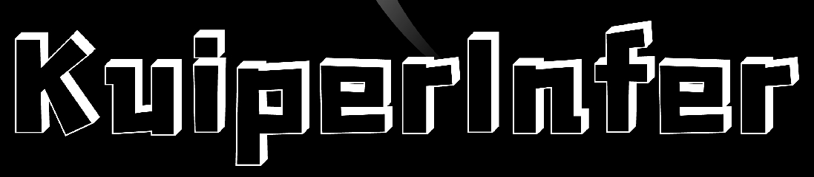
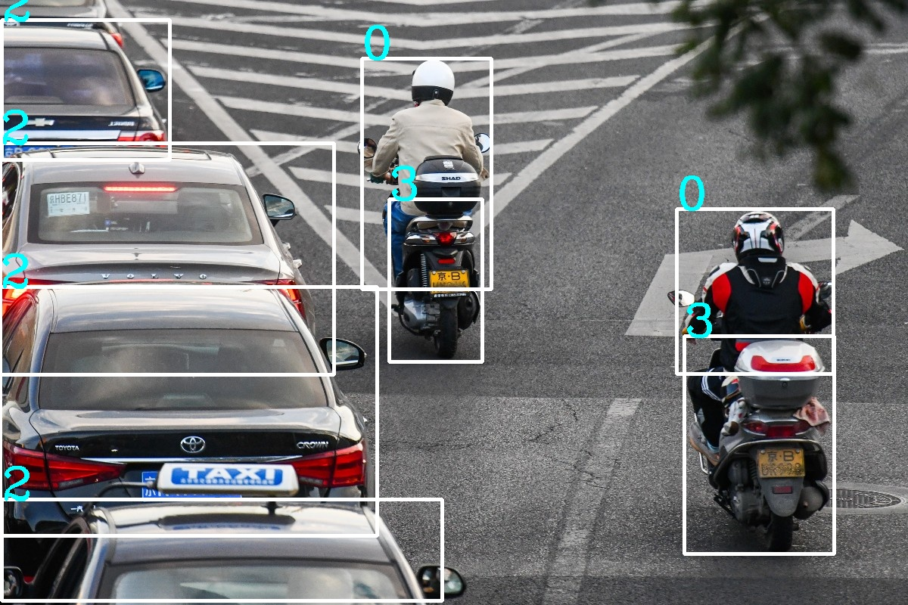

# KuiperInfer (自制深度学习推理框架)




带领你亲手打造一个深度学习推理框架。关注我的[B站空间](https://space.bilibili.com/1822828582)，获取最新视频更新。

跟随本项目，从零开始自制深度学习推理框架，你将有以下收获：
1. 学习一个深度学习框架背后的知识，掌握现代C++项目的写法，调试技巧和工程经验；
2. 如何设计、编写一个计算图；
3. 实现常见的算子，卷积算子、池化算子、全连接算子等；
4. 在3的基础上，学会常见的优化手段加速算子的执行；
5. 最后你将获得一个属于自己的推理框架，可以推理resnet, unet, yolov5, mobilenet等模型，对面试和知识进阶大有裨益。

**视频课程链接：**[https://space.bilibili.com/1822828582](https://space.bilibili.com/1822828582)

## 对llama的支持
> 我们将[llama.c](https://github.com/karpathy/llama2.c )中的算子替换为了KuiperInfer中的实现

[模型下载链接](https://pan.baidu.com/s/1PF5KqvIvNFR8yDIY1HmTYA?pwd=ma8r ) 下载后替换到demos/llama2/main.cpp中


## 第二次课程大纲

第二次课程是第一次课程的重置版，内容更加充实和完善，第一次课程大纲见下方章节。

| 课程节数                                              | 进度  | 课程链接                                    |
| ----------------------------------------------------- |-----| ------------------------------------------- |
| **第一讲** 项目预览和环境配置                         | 完成  | https://www.bilibili.com/video/BV118411f7yM |
| **第二讲** 张量(Tensor)的设计与实现                   | 完成  | https://www.bilibili.com/video/BV1hN411k7q7 |
| **第三讲** 计算图的定义                               | 完成  | https://www.bilibili.com/video/BV1vc411M7Yp |
| **第四讲** 构建计算图关系和执行顺序                   | 完成  | https://www.bilibili.com/video/BV19s4y1r7az |
| **第五讲** KuiperInfer中的算⼦和注册⼯⼚                 | 完成  | https://www.bilibili.com/video/BV1gx4y1o7pj |
| **第六讲** 卷积和池化算子的实现                       | 完成  | https://www.bilibili.com/video/BV1hx4y197dS |
| **第七讲** 表达式层中词法分析和语法分析以及算子的实现 | 完成  | https://www.bilibili.com/video/BV1j8411o7ao |
| **第八讲** 自制推理框架支持Resnet网络的推理           | 完成  | https://www.bilibili.com/video/BV1o84y1o7ni |
| **第九讲** 自制推理框架支持YoloV5网络的推理           | 完成  |    https://www.bilibili.com/video/BV1Qk4y1A7XL                                        |


## 知乎专栏（更新中）
<a href="https://www.zhihu.com/column/c_1682405983161356288">  </a>

## Demo效果

### Unet语义分割

> 🥰 KuiperInfer当前已支持Unet网络的推理，采用[carvana的预训练权重](https://github.com/milesial/Pytorch-UNet)


推理复现可参考文末的 **运行 Kuiper 的 demo**

### Yolov5目标检测

> Demo直接使用yolov5-s的预训练权重(coco数据集)，使用KuiperInfer推理




## 第一次课程大纲

我在b站上开了一门教学课程，目前是课程的前13次课程。课程大纲如下，主页是: https://space.bilibili.com/1822828582 , 欢迎大家关注支持。**进学习群的方式如上图的二维码。**

| 课程节数   | 主要内容                                                   | 进度 | 课程链接                                     |
| ---------- | ---------------------------------------------------------- | ---- | -------------------------------------------- |
| 第一次课   | 整体框架解读和开发环境配置                                 | 完成 | https://www.bilibili.com/video/BV1HV4y1A7H8/ |
| 第二次课   | 张量Tensor类的解析和输入数据的内存排布                     | 完成 | https://www.bilibili.com/video/BV1Ed4y1v7Gb/ |
| 第三次课   | 从CSV文件中初始化张量Tensor一个实例                        | 完成 | https://www.bilibili.com/video/BV1Pg411J7V5/ |
| 第四次课   | 手写第一个算子Relu并完成算子注册工厂类                     | 完成 | https://www.bilibili.com/video/BV1bG4y1J7sQ/ |
| 第五次课   | Im2col的原理和卷积算子的实现                               | 完成 | https://www.bilibili.com/video/BV1F841137Ct  |
| 第六次课   | 照猫画虎，完成MaxPooling算子                               | 完成 | https://www.bilibili.com/video/BV1m3411S7yy  |
| 第七次课   | 图结构(PNNX)讲解和计算图初步                               | 完成 | https://www.bilibili.com/video/BV1VW4y1V7vp  |
| 第八次课   | 读取PNNX并构建自己的计算图                                 | 完成 | https://www.bilibili.com/video/BV1HY4y1Z7S3  |
| 第九次课   | 卷积算子的实现和im2col加速计算的原理                       | 完成 | https://www.bilibili.com/video/BV1F841137Ct  |
| 第十次课   | 再探Tensor类，构建计算图的图关系以及对算子的输入输出预分配 | 完成 | https://www.bilibili.com/video/BV1M54y1K7AG  |
| 第十一次课 | 算子的执行流程                                             | 完成 | https://www.bilibili.com/video/BV1wY411C7Kv  |
| 第十二次课 | 用我们自制的推理框架完成ResNet网络的推理和图片的分类       | 完成 | https://www.bilibili.com/video/BV1jD4y1M772  |
| 第十三次课 | 用自制的推理框架支持Yolov5模型的推理                       | 完成 | https://www.bilibili.com/video/BV1xs4y1J7t2  |


## 项目贡献

### 贡献者列表

感谢以下同学对Kuiperinfer的付出
- [zjhellofss](https://github.com/zjhellofss)
- [liuxubit](https://github.com/liuxubit)
- [Azusachan](https://github.com/Azusachan)
- [wfs2010](https://github.com/wfs2010)
- [mlmz](https://github.com/minleminzui)
- [Tigerrr07](https://github.com/Tigerrr07)
- [zyt1024](https://github.com/zyt1024)
- [zpye](https://github.com/zpye)
- [cmcamdy](https://github.com/cmcamdy)
- [superCB](https://github.com/SuperCB)
- [sanbuphy](https://github.com/sanbuphy)
- [TypeFloat](https://github.com/TypeFloat)
- [Jasmine-up](https://github.com/Jasmine-up)
- [PerrySkywalker](https://github.com/PerrySkywalker)

### 如何参与项目贡献？
1. 提交代码增加新功能或修改bug；
2. 提出特别有用的建议；
3. 完善文档或增加单元测试。

### 本项目和视频课程的关系
- 本项目相当于课程的上游或者预研项目

- 这里的每一个功能都有可能成为视频课程中的知识点，无论是我开发的还是其他同学完善的。

## 使用的技术和开发环境
* 开发语言：C++ 17
* 数学库：Armadillo + OpenBlas(或者更快的Intel MKL)
* 加速库：OpenMP
* 单元测试：Google Test
* 性能测试：Google Benchmark

## 安装过程(使用Docker)
1. docker pull registry.cn-hangzhou.aliyuncs.com/hellofss/kuiperinfer:latest
2. sudo docker run -t -i registry.cn-hangzhou.aliyuncs.com/hellofss/kuiperinfer:latest /bin/bash
3. cd code 
4. git clone --recursive https://github.com/zjhellofss/KuiperInfer.git 
5. cd KuiperInfer
6. **git checkout -b 你的新分支 study_version_0.02 (如果想抄本项目的代码，请使用这一步切换到study tag)**
7. mkdir build 
8. cd build 
9. cmake -DCMAKE_BUILD_TYPE=Release -DDEVELOPMENT=OFF .. 
10. make -j$(nproc)

**Tips:**

1. **如果需要对KuiperInfer进行开发**，请使用 git clone  --recursive https://github.com/zjhellofss/KuiperInfer.git 同时下载子文件夹tmp, 并在cmake文件中设置`$DEVELOPMENT`或者指定`-DDEVELOPMENT=ON`
2. **如果国内网速卡顿**，请使用 git clone https://gitee.com/fssssss/KuiperInferGitee.git 
3. **如果想获得更快地运行体验**，请在本机重新编译openblas或apt install intel-mkl

## 安装过程(构建Docker镜像)
1. docker build -t kuiperinfer:latest .
2. docker run --name kuiperinfer -it kuiperinfer:latest /bin/bash
3. cd /app
4. 余下步骤参考上述安装过程的步骤4-10

##  安装过程(不使用docker)
1. git clone --recursive https://github.com/zjhellofss/KuiperInfer.git
2. **git checkout -b 你的新分支 study_version_0.01 (如果想抄本项目的代码，请使用这一步切换到study tag)**
3. 安装必要环境(openblas推荐编译安装，可以获得更快的运行速度，或者使用apt install intel-mkl替代openblas)
```shell
 apt install cmake, libopenblas-dev, liblapack-dev, libarpack-dev, libsuperlu-dev
```
4. 下载并编译armadillo https://arma.sourceforge.net/download.html
5. 编译安装glog\google test\google benchmark
6. 余下步骤和上述一致

**Tips:**
1. google benchmark编译过程中，如果遇到关于gtest缺失的报错，可以在google benchmark的cmake中关闭gtest选项

## 运行 Kuiper 的 demo

### 运行Unet的推理

请在编译后复制 `tmp/unet/demo` 文件夹下的 test.png 图片绝对地址或相对地址，
随后在 `build/demos` 中按下列格式运行推理程序

```bash
./unet_test test.png unet_demo.pnnx.param unet_demo.pnnx.bin
```

其中 pnnx 模型的下载地址：https://cowtransfer.com/s/09c7f337bab443

若推理成功，你将会在文件夹内看到原图的分割后结果 unet_output.jpg .

### 运行Yolov5的推理

请在demos文件夹下的yolo_test.cpp文件夹中以下代码进行修改

```cpp
const std::string& image_path = "imgs/car.jpg";
const std::string& param_path = "tmp/yolo/demo/yolov5s_batch8.pnnx.param";
const std::string& bin_path = "tmp/yolo/demo/yolov5s_batch8.pnnx.bin";
```

- `image_path`指定图像目录，`param_path`为模型的参数文件，`bin_path`为模型的权重文件，请替换为自己本地的路径。

- 模型定义和权重下载地址如下： https://cowtransfer.com/s/9bc43e0905cb40 

- 编译完成后，在项目目录调用 `./build/demos/yolo_test`


## 已经支持的算子
**总体理念：逐步优化已经有的算子；有需要的时候再对未实现的算子进行开发**

- Convolution 
- AdaptivePooling 
- MaxPooling 
- Expression(抽象语法树)
- Flatten, View(维度展平和变形)
- Sigmoid 
- HardSigmoid 
- HardSwish 
- ReLU
- Linear(矩阵相乘)
- Softmax 
- BatchNorm
- Upsample
- SiLU
- Concat
- ConvTranspose

## 目录
**source**是源码目录

1. **data/** 是张量类Tensor的实现和Tensor初始化方法
2. **layer/** 是算子的实现
3. **parser/** 是Pnnx表达式的解析类
4. **runtime/** 是计算图结构，解析和运行时相关

**test**是单元测试目录，基本做到public方法单元测试权覆盖

**bench**是google benchmark, 包含对MobilenetV3, Resnet18和yolov5s的性能测试。

## 性能测试
### 测试设备

15 核心的AMD EPYC 7543(霄龙) 32-Core Processor (Docker 容器，宿主机共有32核心)

### 编译环境

gcc (Ubuntu 9.4.0-1ubuntu1~20.04.1) 9.4.0

### 性能结果
耗时通过连续五次运行,并以求平均的方式计算

| **input size**         | **模型名称**     | **计算设备**              | **耗时**         |
| ---------------------- | ---------------- | ------------------------- | ---------------- |
| 224×224 batch = 8      | MobileNetV3Small | CPU(armadillo + openblas) | 6.76ms / image   |
| 224×224 batch = 8      | ResNet18         | CPU(armadillo + openblas) | 23.53ms / image  |
| 224×224 batch =16      | ResNet18         | CPU(armadillo + openblas) | 13.52ms / image  |
| 640×640 batch = 8      | Yolov5nano       | CPU(armadillo + openblas) | 78.37ms / image  |
| **640×640** batch = 8  | **Yolov5s**      | CPU(armadillo + openblas) | 177.54ms / image |
| **640×640** batch = 16 | **Yolov5s**      | CPU(armadillo + openblas) | 134.57ms / image |

## 致谢

推理框架NCNN，已经在借鉴的代码中保留了NCNN的BSD协议 https://github.com/Tencent/ncnn

优秀的数学库Openblas: https://github.com/xianyi/OpenBLAS

优秀的数学库Armadillo: https://arma.sourceforge.net/docs.html

给予我灵感的Caffe框架: https://github.com/BVLC/caffe

fmath框架：https://github.com/herumi/fmath/
